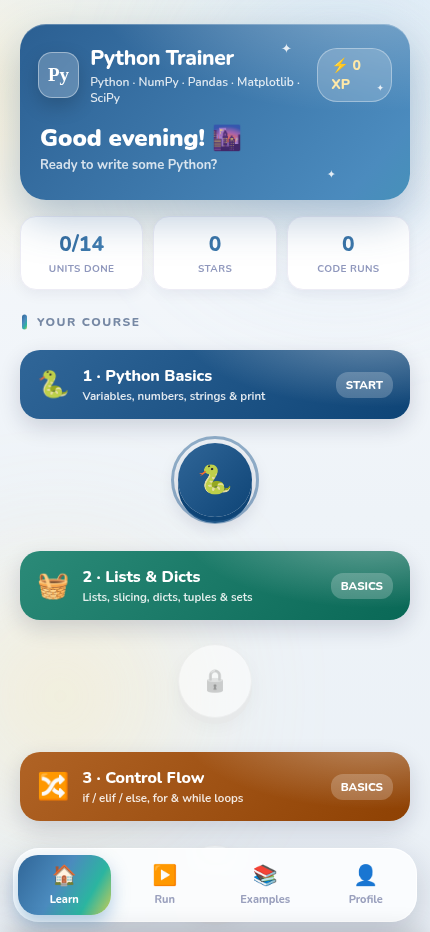
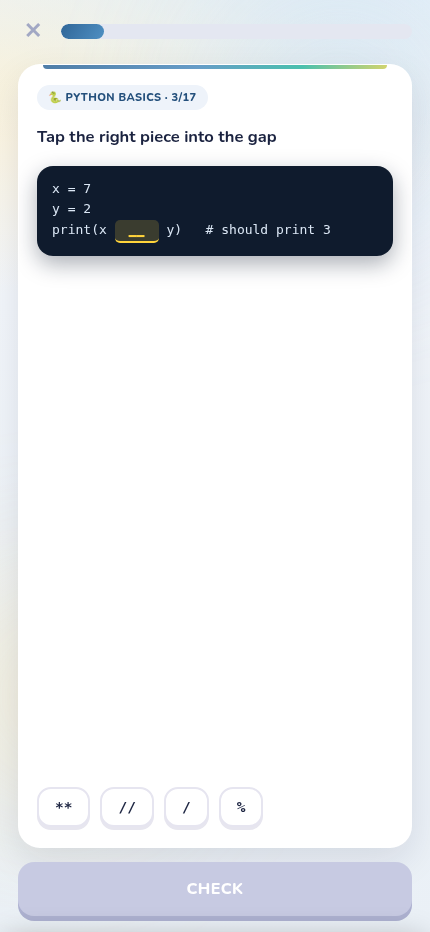
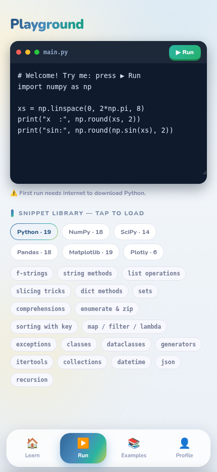
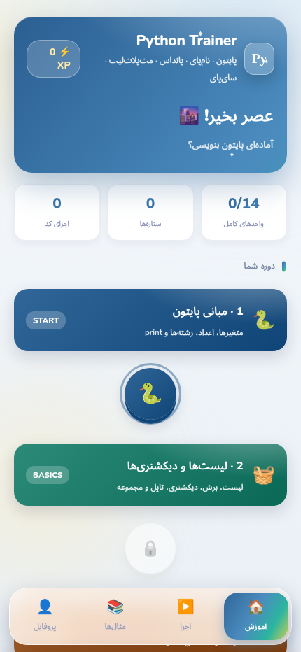

<div align="center">


# Python Trainer

**Learn Python, NumPy, SciPy, Pandas & Matplotlib — with a real Python running inside the app.**
A beautiful Duolingo-style course with runnable examples, quizzes, stars and XP. Fully trilingual: **English · Deutsch · فارسی**.

[](https://bluerrror.github.io/python-trainer/)
&nbsp;


</div>

---

## ✨ Features

- **▶️ Run real Python inside the app** — powered by [Pyodide](https://pyodide.org) (CPython compiled to WebAssembly). Every example has a **Run** button; output and even **Matplotlib figures render right below the code**.
- **🗺️ Structured course** — 8 units on a Duolingo-style path with locks, star ratings and XP:
  1. 🐍 Python Basics — variables, numbers, strings, f-strings
  2. 🧺 Lists & Dicts — collections, slicing, sets, tuples
  3. 🔀 Control Flow — if/elif/else, for, while
  4. 🧩 Functions — def, lambda, comprehensions, modules
  5. 🔢 NumPy Arrays — arange, linspace, slicing, boolean masks
  6. ➗ NumPy Math & SciPy — statistics, broadcasting, integrate, optimize
  7. 🐼 Pandas — DataFrames, selection, filtering, groupby
  8. 📊 Matplotlib — line, scatter, bar, histogram
- **📝 48 quiz questions** — "what does this print?"-style checks with instant feedback and explanations.
- **🧪 Playground** — a free code editor with quick-start snippets; write and run anything.
- **📚 20 curated examples** — FizzBuzz to Monte-Carlo π, curve fitting, groupby analysis, heatmaps, random walks… one tap opens each in the Playground.
- **🌐 Trilingual** — the entire UI and all lesson content in English, German and Persian (with proper RTL); switch anytime in Profile → Settings.
- **🎮 Game feel** — XP, stars, unit unlocking, confetti, the same polished design as its sister language-trainer apps.
- **📴 Offline-friendly** — the app shell works offline; the Python runtime (~10 MB + packages) downloads once from the CDN on first run and is then cached by the service worker.

## 📱 Screenshots

<div align="center">

&nbsp;

&nbsp;

&nbsp;

</div>

## 🚀 Install on your iPhone (≈2 minutes)

1. Open **Safari** and go to **[bluerrror.github.io/python-trainer](https://bluerrror.github.io/python-trainer/)**.
2. Tap the **Share** button (□↑) → **Add to Home Screen** → **Add**.

You get a **"Py" icon** that opens fullscreen. Lessons & quizzes work offline; the first ▶ Run needs internet once.

## 🤖 Install on Android

Download **[python-trainer.apk](https://github.com/Bluerrror/python-trainer/releases/latest/download/python-trainer.apk)** (from [Releases](https://github.com/Bluerrror/python-trainer/releases)), open it on your phone and allow the install. Fully native — no browser bar.

## 💻 Run locally

```bash
cd Python_app
python3 -m http.server 8000     # then open http://localhost:8000
```

> Use a local server (not `file://`) so the service worker and Pyodide load correctly. The first **▶ Run** needs internet to fetch the Python runtime.

## 🛠️ Tech

- Vanilla HTML/CSS/JS — no build step. `index.html` (engine + UI), `content.js` (trilingual course), `runner.js` (Pyodide bridge), `sw.js` (offline caching incl. a cache-first Pyodide runtime cache).
- Sister apps: [Deutsch Trainer](https://github.com/Bluerrror/deutsch-trainer) · [English Trainer](https://github.com/Bluerrror/english-trainer)

## 📄 License

MIT.
